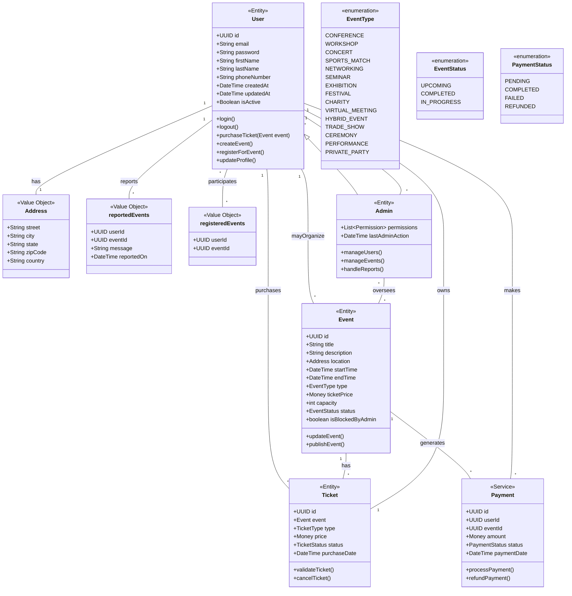

# Important Notice

**Attention:** The information in this documentation may not reflect the most current state of the project. Due to our intense focus on development and implementation, we may have inadvertently neglected to update this documentation in real-time. We apologize for any inconvenience this may cause and appreciate your understanding.

# Eventify API

A robust REST API system for managing events and ticket bookings. This system allows users to create, manage, and book events, with comprehensive admin controls and user management features.

## Features

- User Authentication & Authorization
- Event Management
- Ticket Booking System
- Admin Dashboard
- Event Reporting System
- Secure API Endpoints
- MongoDB Integration
- JWT Authentication

## Tech Stack

- Node.js
- Express.js
- MongoDB Atlas
- JWT for Authentication
- Various NPM packages for security and functionality

## Project Structure

```
📦 eventify
 ┣ 📂 api
 ┃ ┣ 📂 docs
 ┃ ┃ ┗ 📂 openapi
 ┃ ┣ 📂 service
 ┃ ┃ ┣ 📂 controllers
 ┃ ┃ ┣ 📂 models
 ┃ ┃ ┣ 📂 routers
 ┃ ┃ ┣ 📂 services
 ┃ ┃ ┗ 📜 app.js
 ┃ ┣ 📜 .env
 ┃ ┣ 📜 .gitignore
 ┃ ┗ 📜 server.js
```

## Setup Instructions

1. Clone the repository

```bash
git clone <repository-url>
cd eventify
```

2. Install dependencies

```bash
npm install
```

3. Set up environment variables
   Create a `.env` file in the root directory with the following variables:

```env
PORT=9000
MONGODB_URI=your_mongodb_connection_string
JWT_SECRET=your_jwt_secret
JWT_EXPIRY=24h
```

4. Start the server

```bash
# Development mode
npm run dev
```

## API Documentation

The API is documented using OpenAPI specification. You can find the full documentation in the `/api/docs/openapi` directory.

### Key Endpoints

- `/api/users/signup` - User registration
- `/api/users/login` - User authentication
- `/api/events` - Event management
- `/api/admin/*` - Admin endpoints
- `/api/events/:eventId/register` - Event registration

## Security Features

- JWT Authentication
- Password Hashing
- Rate Limiting
- CORS Protection
- Security Headers
- Request Validation

## Error Handling

The API implements comprehensive error handling with appropriate HTTP status codes and error messages.

## Contributing

1. Fork the repository
2. Create your feature branch
3. Commit your changes
4. Push to the branch
5. Open a Pull Request



**Team members and contact information:**
| Name | Email ID |
| ------------- |:---------------------------: |
| 1. Aditya Raj | raj.aditya@northeastern.edu |
| 2. Mayur Veer | veer.m@northeastern.edu |
| 3. Rushabh Darji | darji.ru@northeastern.edu |
| 4. Yash Vyas | vyas.yash@northeastern.edu |
