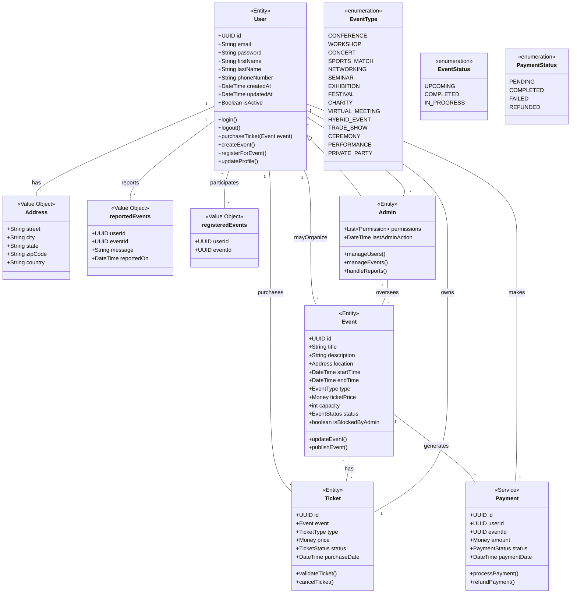

#Domain Model for Eventify Website

```mermaid
---
Title: Eventify Model
---

classDiagram
    class User {
        <<Entity>>
        +UUID id
        +String email
        +String password
        +String firstName
        +String lastName
        +String phoneNumber
        +DateTime createdAt
        +DateTime updatedAt
        +Boolean isActive
        +login()
        +logout()
        +purchaseTicket(Event event)
        +createEvent()
        +registerForEvent()
        +updateProfile()
    }

    class Event {
        <<Entity>>
        +UUID id
        +String title
        +String description
        +Address location
        +DateTime startTime
        +DateTime endTime
        +EventType type
        +Money ticketPrice
        +int capacity
        +EventStatus status
        +boolean isBlockedByAdmin
        +updateEvent()
        +publishEvent()
    }

    class Ticket {
        <<Entity>>
        +UUID id
        +Event event
        +TicketType type
        +Money price
        +TicketStatus status
        +DateTime purchaseDate
        +validateTicket()
        +cancelTicket()
    }

    class Address {
        <<Value Object>>
        +String street
        +String city
        +String state
        +String zipCode
        +String country
    }

    class reportedEvents{
        <<Value Object>>
        +UUID userId
        +UUID eventId
        +String message
        +DateTime reportedOn
    }

    class registeredEvents{
        <<Value Object>>
        +UUID userId
        +UUID eventId
    }

    class Admin {
        <<Entity>>
        +List~Permission~ permissions
        +DateTime lastAdminAction
        +manageUsers()
        +manageEvents()
        +handleReports()
    }
    
    class Payment {
        <<Service>>
        +UUID id
        +UUID userId
        +UUID eventId
        +Money amount
        +PaymentStatus status
        +DateTime paymentDate
        +processPayment()
        +refundPayment()
    }
    
    class EventType {
        <<enumeration>>
        CONFERENCE
        WORKSHOP
        CONCERT
        SPORTS_MATCH
        NETWORKING
        SEMINAR
        EXHIBITION
        FESTIVAL
        CHARITY
        VIRTUAL_MEETING
        HYBRID_EVENT
        TRADE_SHOW
        CEREMONY
        PERFORMANCE
        PRIVATE_PARTY
    }
    
    class EventStatus{
        <<enumeration>>
        UPCOMING
        COMPLETED
        IN_PROGRESS
    }

    class PaymentStatus{
        <<enumeration>>
        PENDING
        COMPLETED
        FAILED
        REFUNDED
    }

    User "*" -- "*" registeredEvents : participates
    User "1" -- "*" Ticket : purchases
    Ticket "1" -- "1" User : owns
    User "1" -- "*" Event : mayOrganize
    User <|-- Admin
    User "1" -- "1" Address : has
    Event "1" -- "*" Ticket : has
    Event "1" -- "*" Payment : generates
    User "1" -- "*" Payment : makes
    User "1" -- "*" reportedEvents : reports
    Admin "*" -- "*" User : manages
    Admin "*" -- "*" Event : oversees

```    